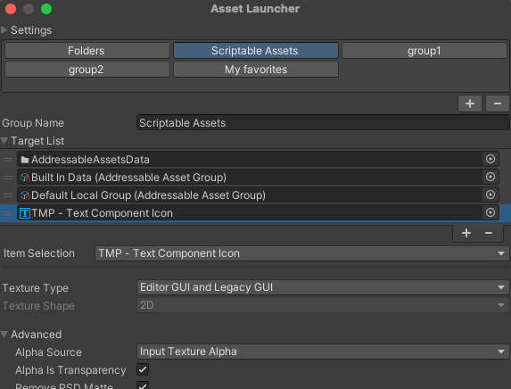

Unity Asset Launcher
===

About Unity Asset Launcher
---
It is a very simple and easy-to-use asset launcher.

It helps you register frequently used assets or assets whose location you tend to forget so that you can access them easily.

You can also select registered assets and display their inspectors, making it easier to edit ScriptableObjects, for example.

You can easily Open and Close them from a shortcut key.

Attach comment to Items
---

Item Selection
--- 

Usage
--- 

[Window] -> [Asset Launcher]
to show the Asset Launcher Window.

OR

Shortcut keys can be used to switch the window display.
- Ctrl + L
- Ctrl + Mouse Middle Button

UPM
--- 
**https://github.com/yassy0413/UnityAssetLauncher.git**

You can install from Package Manager.

