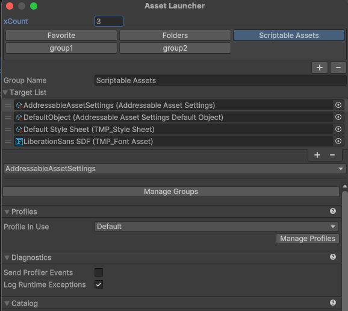
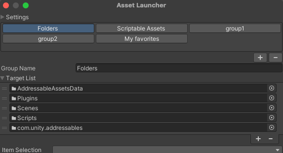
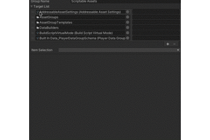
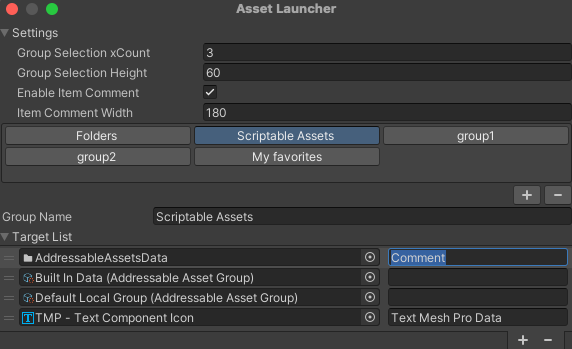
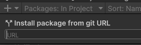

# Unity Asset Launcher

[English](README.md)

Unity Asset Launcher は、よく使う Unity アセットをすぐ開けるようにするためのシンプルな Editor 拡張です。

フォルダ、ScriptableObject、Material、Texture、TimelineAsset、Prefab、Scene などのプロジェクトアセットを登録して、コンパクトなウィンドウから選択・Inspector 表示できます。





## 機能

- よく使うアセットを launcher group に登録できます。
- 登録したアセットを選択し、launcher 内に Inspector を表示できます。
- 複数 group でアセットを整理できます。
- group 名、group ボタンの文字色・背景色を変更できます。
- launcher item を並べ替えできます。
- item に任意のコメントを付けられます。
- アセットを group にドラッグ & ドロップで追加できます。
- `TimelineAsset` の場合は Timeline Editor を開けます。
- ショートカットで launcher window を素早く開閉できます。
- 任意で group 切り替え用ショートカットを設定できます。
- 設定はユーザーごとのローカル Editor データとして保存されます。

## 使い方

launcher は以下から開けます。

```text
Window > Asset Launcher
```

同じメニュー項目で launcher window の表示を切り替えます。すでに開いている場合は閉じます。

以下のショートカットでも開閉できます。

```text
Ctrl + L
Ctrl + Middle Mouse Button
```



## Groups

アセットは group 単位で整理します。

group エリアの `+` / `-` ボタンで group を追加・削除できます。

各 group では以下を設定できます。

- Group name
- Font color
- Background color
- Optional shortcut key
- Target asset list

Unity Input System が有効な場合、各 group に `Ctrl + Key` の切り替えショートカットを設定できます。

## Items

アイテムのダブルクリックで、Prefab・Scene・スクリプトなどを Unity 標準の方法で開きます。コメント欄のダブルクリックはテキスト編集として扱います。

現在の group へアセットを追加するには、Project ウィンドウから target list へドラッグ & ドロップします。挿入位置はマーカーで表示され、行と行の間にドロップするとその位置に、行の下の空き領域にドロップすると最後尾に追加されます。

各行にはアセットのアイコンと名前が表示されます。

- 行をクリックすると、Project ウィンドウでそのアセットが選択（ping）され、launcher window 内に Inspector が表示されます。
- 行をドラッグして並べ替えられます。
- 行を右クリックして `Remove` を選ぶか、リストにフォーカスがある状態で `Delete` / `Backspace` キーを押すと削除できます。複数行を選択している場合はまとめて削除されます。

フォルダの場合は、フォルダ内の最初のアセットを ping して、フォルダへ素早く移動しやすくします。

Texture など importer inspector を持つアセットでは、importer inspector を表示します。

`TimelineAsset` の場合は `Open Timeline Editor` ボタンが表示されます。

## Item comments

item comment は settings foldout から有効化できます。



有効化:

```text
Settings > Enable Item Comment
```

有効にすると、各 launcher item にコメント欄が表示されます。コメントは item selection dropdown でアセット名の横に表示されます。

似た名前のアセットが複数ある場合や、用途を短くメモしておきたい場合に便利です。

## Settings

launcher window 上部の `Settings` foldout から以下を設定できます。

- Group selection column count
- Item comment visibility
- Item comment width
- Item font size（target list の行の文字サイズ）
- Group button text alignment
- Layout mode

layout mode は以下の2種類です。

- `Vertical`: 上部に group selector、下部に Inspector を表示します。
- `Horizontal`: 左側に group selector と target list、右側に Inspector を表示します。

`Vertical` レイアウトでは、target list と Inspector の境界をドラッグして高さを調整できます。

ヘッダーのフォルダアイコンから、launcher のデータ保存フォルダを Finder / Explorer で開けます。

## Shortcuts

window 開閉ショートカット:

```text
Ctrl + L
Ctrl + Middle Mouse Button
```

Unity Input System が有効な場合、group ごとに切り替えショートカットを設定できます。

```text
Group > Shortcut Key (Ctrl+)
```

## Settings storage

launcher のデータは Unity の `Application.persistentDataPath` 以下に保存されます。

```text
AssetLauncher/settings.json
AssetLauncher/group/group_{id}.json
```

これにより、launcher 設定はユーザーごとの個人設定として扱われ、デフォルトでは Unity プロジェクトには含まれません。

## UPM でのインストール

Unity Package Manager から以下の Git URL を指定してインストールできます。

```text
https://github.com/yassy0413/UnityAssetLauncher.git
```




## Package information

- Package name: `com.yassy.assetlauncher`
- Unity version: `2020.1` 以降
- License: `GPL-3.0`
